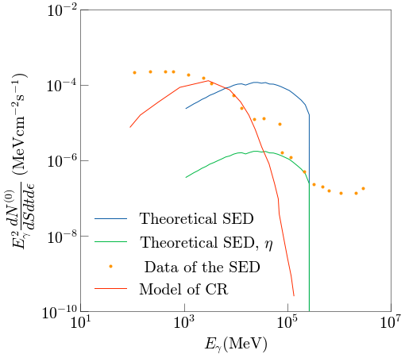

# Radiation-Models-for-the-Crab-pulsar-in-the-GeV-to-TeV-energy-range

These are the codes of my final degree thesis, which are about the models of radiation of Neutron Stars. I especially focused on the Crab pulsar and the GeV to TeV energy range.

This code returns a huge range of different functions and data. The first thing to notice is the normalized flux of the incoming photons, which ranges from an energy of 0.4 keV to an energy of 250 keV. The fit has been done with an asymmetric Lorentz function. The fit of the lowest interval is seen in the following image:

    

Afterwards, the spectral energy distribution, that our model has returned, with some predictions of other energy bands to compare is shown. The result can be seen in the following image. Note that our results match in a certain energy interval as one should expect.

  

Then, the flux of the final photons is plotted with respect to the phase. Note that for every interval of final energy chosen, a different plot appears. Each different flux also fits an asymmetric Lorentz function. The result of the lowest energy interval is

Then, the displacement of the peak of these Lorentz functions was plotted to compare them to the experimental results. The result is shown in the following image

Finally, the theoretical flux that our model gives, is compared to the experimental flux obtained as the following image shows

Please, note that we are currently working to improve the results, as the theoretical flux does not look anything like the experimental flux.

We are now implementing an anisotropy part which will make the results much more accurate and are based on result from PIC simulations.

